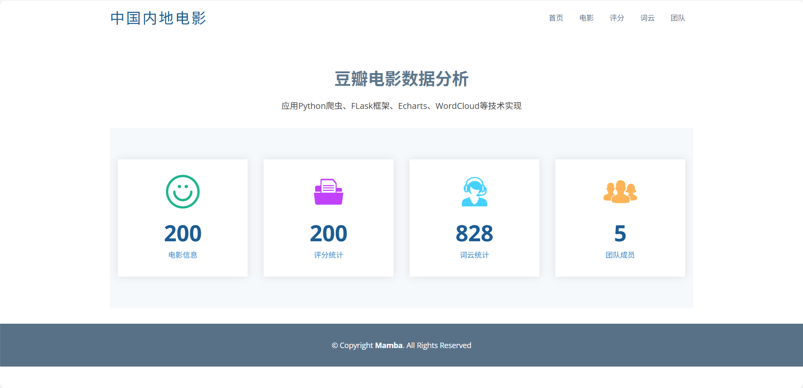
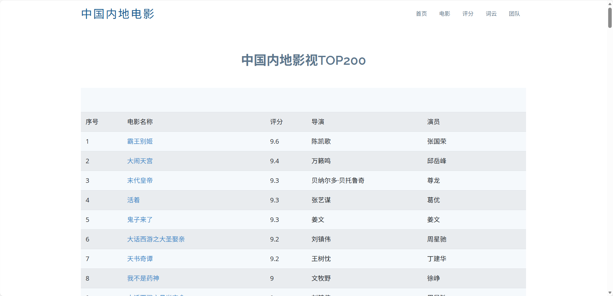
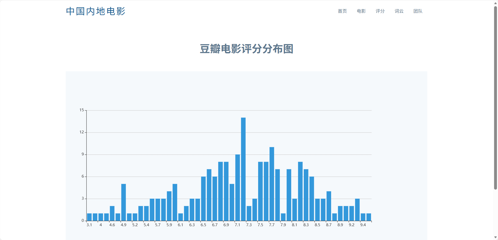
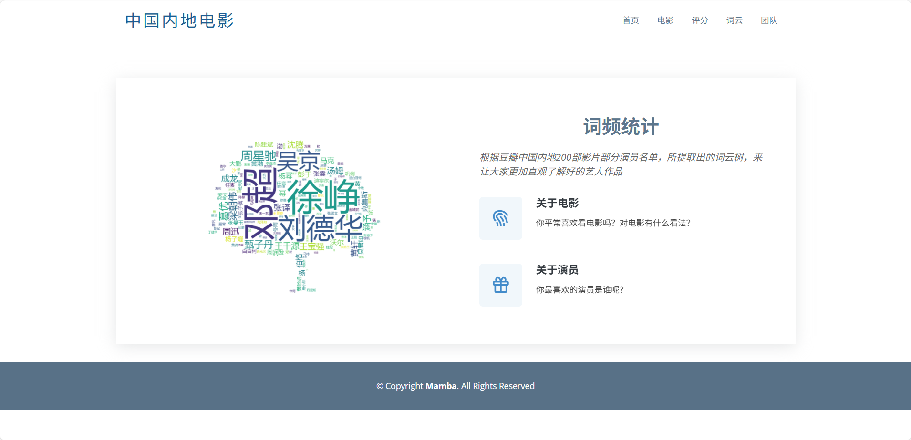

# 🎬 中国内地电影数据采集与可视化分析系统


## 📖 项目简介
本项目是一个基于 **Python Flask** 的全栈数据分析系统。针对 **豆瓣电影** 进行数据抓取，通过 **SQLite** 存储数据，并利用 **ECharts** 和 **WordCloud** 实现了丰富的数据可视化展示。

项目核心功能包括：
* **网络爬虫**：突破反爬机制，高效抓取电影 Top200 数据。
* **数据存储**：结构化存储电影基本信息、评分、导演演员等字段。
* **可视化大屏**：直观展示评分分布、词云统计及数据列表。

## 📸 运行效果展示 (Project Demo)

### 1. 系统首页 / 数据概览
简洁的仪表盘设计，直观展示爬取到的电影总数（200部）、评分统计条目及词云统计条目。


### 2. 电影 Top200 数据列表
以表格形式展示爬取的详细数据，包含排名、电影名、评分、导演及演员阵容，支持快速查阅。


### 3. 评分分布分析 (ECharts)
使用动态柱状图分析 Top200 电影的评分分布情况，直观呈现大众口碑的集中区间。


### 4. 演员/导演词云统计
基于电影数据生成词云，字号越大代表该影人上榜作品越多（如吴京、徐峥、刘德华等），直观反映影坛影响力。


## 🛠️ 技术栈 (Tech Stack)
* **后端**: Python, Flask
* **数据采集**: Requests, BeautifulSoup, Re (正则表达式)
* **前端**: HTML5, CSS, JavaScript
* **可视化**: ECharts, WordCloud2.js
* **数据库**: SQLite3

## 📂 项目结构
```text
movie-data-visualization/
├── assets/                # 🖼️ 项目演示截图
├── spider/                # 🕸️ 爬虫模块 (数据采集)
│   └── spider.py          # 爬虫执行脚本
├── web/                   # 🖥️ 可视化 Web 模块
│   ├── app.py             # Flask 核心启动文件
│   ├── static/            # 静态资源 (CSS, JS, Images)
│   ├── templates/         # HTML 页面模板
│   └── chinamovie.db      # SQLite 数据库文件
├── README.md              # 项目说明文档
└── requirements.txt       # 依赖包列表
